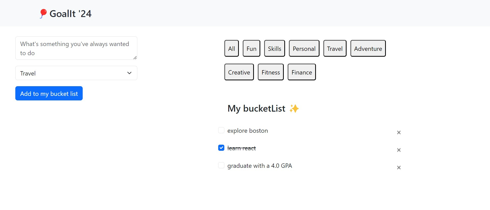

## GoalIT '24 🔥

### Make or break your year with GoalIT 💥🎯
<br/>

### Why GoalIT?
Every year I come up with resolutions but sadly I don't keep track of them nor do I end up completing them. This year I realised to be mindful about how I approach my life in general. Hence, made a little something
to track my goals for the year 2024!

This project is intended to understand Django REST Framework, Redux and how to connect it with my React App. 

### Features:
- Add your goals
- Sort them based on category
- Delete 
- Mark as done

### Development

**For backend**
  
- Make sure you have ```Python```  installed

- ```cd goals```

- To start the backend server use:
```python
python manage.py runserver
```
#### API Endpoints
> Routes
- `GET goals/dashboard/` Get all goals Information
- `POST goals/dashboard/` Create a new goal
- `DELETE goals/dashboard/{id}/` Delete a goal


**For frontend**

- Make sure you have Node.js installed

  ```cd client```

  - Install all the project dependencies
  ```js
  npm i
  ```
  - Start the app ```npm start```

 - Check http://localhost:3000/





(UI Changes coming soon, please don't judge)
